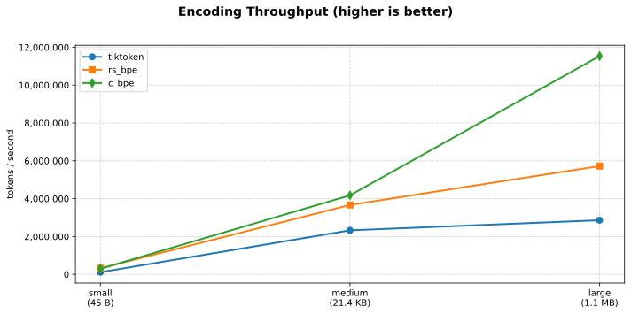
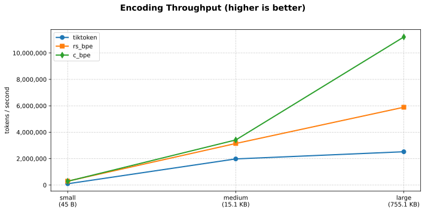
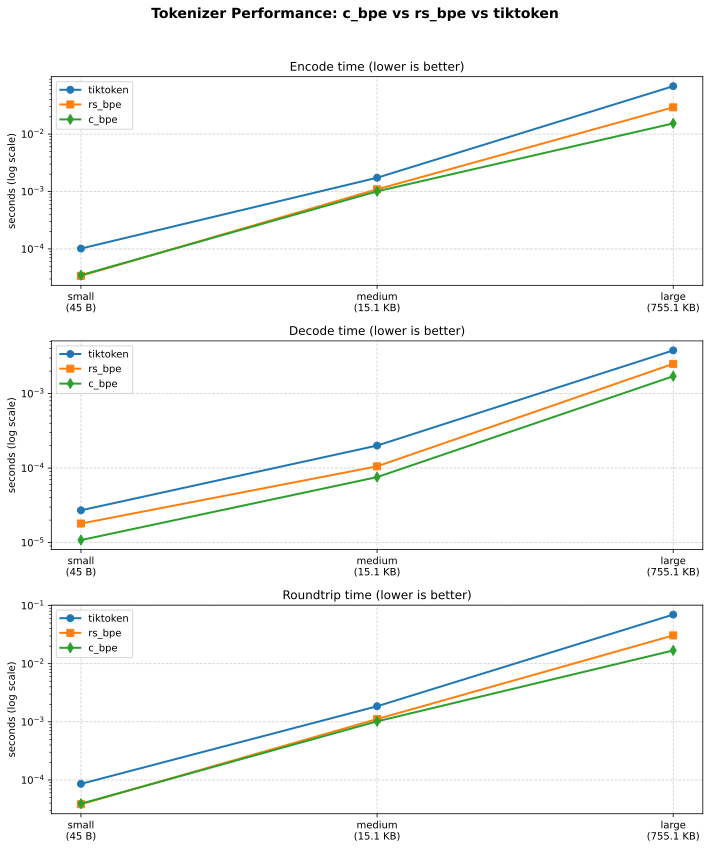
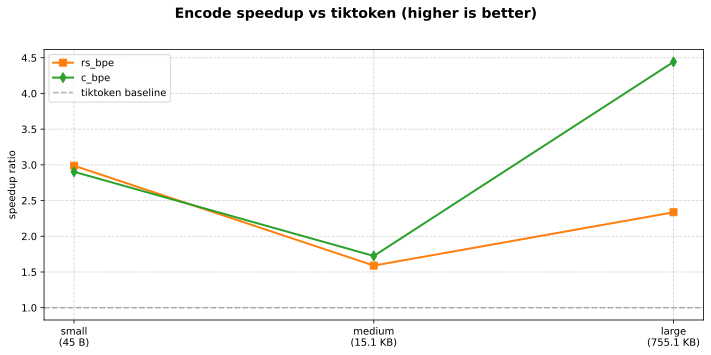

[](https://github.com/gweidart/rs-bpe/actions/workflows/ci.yml) &nbsp; [](https://github.com/gweidart/rs-bpe/actions/workflows/gh_release.yml) &nbsp; [](https://github.com/gweidart/rs-bpe/actions/workflows/release.yml)

The main purpose of this library is to provide fast and correct token counting for chunking algorithms with a focus on high performance. It implements novel algorithms for BPE tokenization that are both correct and significantly faster than existing solutions.

#### Installation

##### Python Package

```
pip install rs-bpe
```

*Both rs_bpe (Rust) and c_bpe (C) consistently outperform tiktoken (March 7, 2026)*



## Key Features

* Efficient token counting with linear time complexity even for adversarial inputs
* Split text at exact token boundaries while respecting UTF-8 character boundaries
* Incrementally count tokens while appending text to a chunk
* Calculate token counts for sub-ranges of text with constant-time complexity
* Python bindings with OpenAI-compatible interface

These operations are particularly important for LLM applications but are challenging to implement efficiently for BPE tokenization.

## Motivation *(problems this library aims to solve)*

Existing BPE tokenizers often face performance and correctness issues when used for chunking operations:

### Split-at-N-Tokens Problem

Naively splitting text after N tokens by first encoding the entire text and then selecting a boundary often produces suboptimal results:

* The split point might not align with a UTF-8 character boundary
* Dropping tokens until a character boundary is reached might result in chunks much shorter than desired
* The algorithm wastes resources by encoding more text than necessary

### Incremental Counting Problem

Incrementally counting tokens as text is appended is challenging with traditional implementations:

* Recomputing the encoding after every append leads to quadratic complexity
* Approximating counts by aggregating piece counts leads to incorrect results due to BPE's non-monotonic nature
* Incorrect counting can cause problems when staying within token limits for LLM APIs

### Interval Counting Problem

Counting tokens for arbitrary subranges traditionally requires reprocessing the entire substring:

* Leads to poor performance for applications that need to count many subranges
* Makes operations like binary search for token boundaries inefficient

Our library provides novel algorithms to solve these problems with superior performance characteristics.

## Implementation

This repository contains two complementary BPE implementations — **rs_bpe** (Rust) and **c_bpe** (C) — that share the same algorithms and expose the same Python API. Both are fully correct ports of each other; the choice between them is a trade-off between Rust's ownership-based safety and C's predictable ABI and build simplicity.

### rs_bpe — Rust Implementation

rs_bpe is written in Rust with Python bindings via PyO3.

#### Core Algorithm

The novel O(n) algorithm preserves the exact output of the original BPE algorithm by tracking encodings of all text prefixes using mathematical properties of valid BPE encodings.

Instead of storing full token sequences for each prefix, only the last token of each prefix needs to be remembered. This is possible because:

1. There exists exactly one valid encoding sequence for any input text
2. Any substring of a valid encoding sequence is itself a valid encoding sequence
3. Knowing the last token of a valid encoding sequence uniquely determines the full sequence

The algorithm determines the correct last token for each prefix by checking token compatibility with the preceding token, yielding a linear-time solution.

#### Backtracking Optimization

For average-case improvement, a backtracking-based algorithm:

1. Tries the greedy approach first, using the longest matching token at each step
2. Backtracks when necessary to produce a valid BPE encoding
3. Uses a bitfield so worst-case runtime stays linear in input length

#### Special Purpose Encoders

* **AppendableEncoder**: O(1) amortised token-count queries while appending text byte by byte
* **IntervalEncoding**: Preprocesses text once to enable constant-time token counting for any substring
* **BacktrackEncoder**: Fastest correct implementation for general one-shot encoding
* **OpenAI-compatible Tokenizer**: tiktoken-compatible interface supporting cl100k and o200k models

---

### c_bpe — C Implementation

c_bpe is a hand-written C port of the same algorithms, compiled as a native extension with full LTO (`/GL /LTCG` on MSVC, `-flto` on GCC/Clang).

#### Data Structures

* **`BytePairEncoding` struct**: Stores the concatenated token byte array, per-token start offsets, a `BytesMap` (bytes→token id), `split_left`/`split_right` arrays for token decomposition, a `PairMap` (pair→merged token), three Aho-Corasick automatons, and a `next_prefix_match` table.

* **`PairMap`**: Open-addressing hash table (linear probing, 50% max load) for `(token1, token2) → merged_id` lookups. Uses a splitmix64 finaliser instead of byte-by-byte FNV-1a for the fixed 8-byte key, keeping the merge step cache-friendly.

* **`BytesMap`**: Open-addressing hash table for `bytes → token_id` lookups. Uses FNV-1a hashing identical to Rust's `fnv` crate, ensuring consistent hash values across both implementations.

#### Aho-Corasick Automatons

Three Double-Array Aho-Corasick automatons are built over the token vocabulary at initialisation time:

* **`longest_searcher`** (`AC_KIND_LEFTMOST_LONGEST`): leftmost-longest token match at each position — used for the backtrack encoder.
* **`overlapping_searcher`** (`AC_KIND_OVERLAPPING_FWD`): all overlapping forward matches — used by `AppendableEncoder` to maintain per-byte AC state.
* **`overlapping_searcher_rev`** (`AC_KIND_OVERLAPPING_REV`): all overlapping reverse matches — used by `PrependableEncoder`.

The Double-Array layout gives O(1) state transitions per input byte, making the automaton traversal extremely cache-friendly.

#### Special Purpose Encoders (C)

All four encoders from the Rust implementation are ported to C:

* **`AppendableEncoder`**: Stores one `AppState` per byte appended (`ac_state`, `last_token`, running count), allowing O(1) amortised count queries via the forward AC automaton.
* **`PrependableEncoder`**: Mirror of `AppendableEncoder` using the reverse AC automaton — supports O(1) amortised queries while prepending.
* **`IntervalEncoding`**: Precomputes a `last_token`, `tree_id`, `tree_end`, and `tree_depth` array per byte position, enabling typically-O(1) `count(start, end)` queries.
* **OpenAI-compatible Tokenizer**: PCRE2-based pre-tokenisation (regex splitting identical to tiktoken) feeding into the shared BPE encode/decode logic.

## Performance

Our benchmarks show significant performance improvements over existing implementations:

> **Note**: All benchmark results shown here were achieved using the Python bindings, not the direct Rust implementation. This provides a more realistic representation of the performance users will experience in Python applications. Many libraries release benchmarks based solely on their native implementation, which can be misleading as the language boundary crossing adds overhead.

### Single-Text Tokenization

Internal benchmarks show both rs_bpe and c_bpe outperform tiktoken across all text sizes:


| Text Size | rs-bpe vs tiktoken | c\_bpe (C) vs tiktoken |
| ----------- | -------------------- | ----------------------- |
| Small     | 3.0× faster        | 2.9× faster           |
| Medium    | 1.6× faster        | 1.7× faster           |
| Large     | 2.3× faster        | 4.4× faster           |

_Encoding speed (benchmark.py results):




_

```
SMALL TEXT:
  tiktoken: 0.000102s
  rs_bpe:   0.000034s
  c_bpe:    0.000035s

MEDIUM TEXT:
  tiktoken: 0.001735s
  rs_bpe:   0.001092s
  c_bpe:    0.001007s

LARGE TEXT:
  tiktoken: 0.068093s
  rs_bpe:   0.029147s
  c_bpe:    0.015330s
```

Both libraries also provide significantly faster decoding and roundtrip operations:

_Decoding speed:




_

```
SMALL TEXT:
  tiktoken: 0.000027s
  rs_bpe:   0.000018s
  c_bpe:    0.000011s

MEDIUM TEXT:
  tiktoken: 0.000200s
  rs_bpe:   0.000105s
  c_bpe:    0.000076s

LARGE TEXT:
  tiktoken: 0.003799s
  rs_bpe:   0.002504s
  c_bpe:    0.001709s
```

### Batch Processing Performance

Both rs_bpe and c_bpe outperform tiktoken at every batch size for both encoding and decoding:


| Batch Size | rs\_bpe encode | c\_bpe encode | rs\_bpe decode | c\_bpe decode |
| ------------ | -------------- | ------------- | -------------- | ------------- |
| 1          | 79× faster   | 35× faster  | 94× faster   | 165× faster |
| 10         | 43× faster   | 32× faster  | 100× faster  | 92× faster  |
| 100        | 17× faster   | 5× faster   | 52× faster   | 94× faster  |
| 1000       | 13× faster   | 22× faster  | 31× faster   | 57× faster  |

> rs_bpe has lower per-call overhead at small batch sizes; c_bpe's advantage grows at large batches due to its tighter inner loop and better cache behaviour on long texts.

_Encode speedup vs tiktoken (all sizes):




_

```
BATCH ENCODE (n=1):
  tiktoken: 0.000540s
  rs_bpe:   0.000007s  (79× faster)
  c_bpe:    0.000016s  (35× faster)

BATCH ENCODE (n=1000):
  tiktoken: 0.018697s
  rs_bpe:   0.001386s  (13× faster)
  c_bpe:    0.000862s  (22× faster)

BATCH DECODE (n=1000):
  tiktoken: 0.009883s
  rs_bpe:   0.000324s  (31× faster)
  c_bpe:    0.000173s  (57× faster)
```

### Worst-Case Performance

While tiktoken shows quadratic growth for certain adversarial inputs, both rs_bpe and c_bpe maintain linear scaling even in worst-case scenarios. This is critical for production systems that need consistent performance guarantees.

### Key Performance Advantages

1. **Memory Efficiency**: Both implementations use compact data structures (tightly-packed token byte arrays, power-of-2 hash tables at ≤50% load) and avoid redundant token storage
2. **Cache-Friendly Hash Tables**: `PairMap` uses a splitmix64 finaliser for fixed 8-byte keys; `BytesMap` uses FNV-1a — both with linear probing for sequential memory access
3. **O(1) State Transitions**: Double-Array Aho-Corasick automatons enable single-byte-per-step token matching without backtracking through the vocabulary
4. **Thread Pool Optimization**: Batch processing (rs_bpe) uses an optimized Rayon thread pool with smart worker allocation
5. **LTO**: Both implementations compile with full Link-Time Optimisation (Rust LTO / MSVC `/GL`+`/LTCG` / GCC `-flto`)
6. **No Correctness Trade-offs**: Both implementations are verified to produce token-for-token identical output to tiktoken

All benchmarks were run on standard hardware and results may vary based on your specific environment.

## Python Usage Examples

> Both `rs_bpe` and `c_bpe` expose an identical Python API. All examples below use `rs_bpe`; substitute `from c_bpe.bpe import openai` in place of `from rs_bpe.bpe import openai` to use the C implementation.

### Basic Tokenization

```python
from rs_bpe.bpe import openai

# Load OpenAI tokenizers (automatically caches for reuse)
cl100k_tokenizer = openai.cl100k_base()  # GPT-3.5/4 tokenizer
o200k_tokenizer = openai.o200k_base()    # o200k tokenizer

# Basic encoding
text = "Hello, world! This is an example."
tokens = cl100k_tokenizer.encode(text)
print(f"Encoded tokens: {tokens}")

# Basic decoding
decoded_text = cl100k_tokenizer.decode(tokens)
print(f"Decoded text: {decoded_text}")

# Simple token counting
token_count = cl100k_tokenizer.count(text)
print(f"Token count: {token_count}")
```

### Efficient Token Limiting

One of the key features of both implementations is the ability to efficiently count tokens up to a limit, which is useful when you need to stay within token constraints:

```python
from rs_bpe.bpe import openai

tokenizer = openai.cl100k_base()
max_tokens = 50

# Count tokens until limit is reached
text = "This is a long text that might exceed our token limit... " * 20
char_position = tokenizer.count_till_limit(text, max_tokens)

if char_position is not None:
    # We reached the limit before the end of the text
    truncated_text = text[:char_position]
    print(f"Truncated to {tokenizer.count(truncated_text)} tokens")
    print(f"Truncated text: {truncated_text}")
else:
    # The entire text is within our token limit
    print(f"Text is within token limit: {tokenizer.count(text)} tokens")
```

### Batch Processing

Both rs_bpe and c_bpe excel at batch processing, which is perfect for processing large datasets:

```python
from rs_bpe.bpe import openai
import time

# Load the tokenizer
tokenizer = openai.cl100k_base()

# Create a batch of texts
texts = [
    "This is the first document to encode.",
    "Here's another one with different content.",
    "A third document with some more text to process.",
    # Add more as needed...
]

# Configure parallel processing options (optional)
parallel_options = openai.ParallelOptions(
    min_batch_size=20,      # Minimum batch size to engage parallel processing
    chunk_size=100,         # Number of texts to process in each thread
    max_threads=0,          # 0 means use optimal thread count (based on CPU cores)
    use_thread_pool=True    # Reuse thread pool for better performance
)

# Encode batch with performance metrics
start_time = time.time()
result = tokenizer.encode_batch(texts, parallel_options)
end_time = time.time()

print(f"Processed {len(texts)} texts in {result.time_taken:.6f}s")
print(f"Total tokens: {result.total_tokens}")
print(f"Throughput: {result.total_tokens / result.time_taken:.1f} tokens/second")

# Access individual token lists
for i, tokens in enumerate(result.tokens):
    print(f"Text {i} has {len(tokens)} tokens")
```

### Advanced Usage: Checking Token Compatibility

For specialized applications, you might need to check if a text can be tokenized within a specific token limit:

```python
from rs_bpe.bpe import openai

tokenizer = openai.cl100k_base()
max_tokens = 4096

def is_compatible(text, max_tokens):
    """Check if text can be tokenized within the token limit."""
    count = tokenizer.count(text)
    compatible = count <= max_tokens
    return compatible, count

# Example usage for verifying text compatibility
texts_to_check = [
    "Short text that's definitely within limits.",
    "A" * 20000  # A very long text that might exceed limits
]

for i, text in enumerate(texts_to_check):
    compatible, count = is_compatible(text, max_tokens)
    status = "compatible" if compatible else "too long"
    print(f"Text {i}: {status} ({count} tokens)")
```

### Text Chunking

Both rs_bpe and c_bpe can be used to efficiently chunk text based on token counts:

```python
from rs_bpe.bpe import openai

tokenizer = openai.cl100k_base()

def chunk_text(text, max_chunk_tokens=1024, overlap_tokens=50):
    """Split text into chunks of approximately max_chunk_tokens."""
    chunks = []
  
    # Get the full text token count
    total_tokens = tokenizer.count(text)
  
    if total_tokens <= max_chunk_tokens:
        return [text]
  
    # Keep track of where we are in the text
    start_pos = 0
  
    while start_pos < len(text):
        # Find where to end this chunk
        char_position = tokenizer.count_till_limit(text[start_pos:], max_chunk_tokens)
      
        if char_position is None:
            # The rest of the text fits within our limit
            chunks.append(text[start_pos:])
            break
      
        # Add the chunk
        end_pos = start_pos + char_position
        chunks.append(text[start_pos:end_pos])
      
        # Move to the next chunk, considering overlap
        if overlap_tokens > 0 and end_pos < len(text):
            # Move back by overlap tokens
            overlap_char_position = tokenizer.count_till_limit(
                text[start_pos:end_pos], max_chunk_tokens - overlap_tokens
            )
            if overlap_char_position is not None:
                start_pos += overlap_char_position
            else:
                start_pos = end_pos
        else:
            start_pos = end_pos
  
    return chunks

# Example usage
long_text = "This is a long document that needs to be split into chunks. " * 100
chunks = chunk_text(long_text, max_chunk_tokens=100, overlap_tokens=10)

print(f"Split text into {len(chunks)} chunks:")
for i, chunk in enumerate(chunks):
    token_count = tokenizer.count(chunk)
    print(f"Chunk {i}: {token_count} tokens, {len(chunk)} chars")
```

### Thread Pool Configuration

For high-volume applications, rs_bpe exposes explicit thread pool controls via `ParallelOptions` (c_bpe batch processing runs single-threaded per call and relies on the caller for parallelism):

```python
from rs_bpe.bpe import openai
import multiprocessing

# Get the number of CPU cores
cpu_cores = multiprocessing.cpu_count()
physical_cores = cpu_cores // 2  # Approximation for physical cores

# Configure parallel options based on workload needs
low_latency_options = openai.ParallelOptions(
    min_batch_size=1,        # Parallelize even small batches
    chunk_size=10,           # Process in smaller chunks
    max_threads=2,           # Use fewer threads to minimize overhead
    use_thread_pool=True
)

high_throughput_options = openai.ParallelOptions(
    min_batch_size=50,                # Only parallelize large batches
    chunk_size=200,                   # Larger chunks for better efficiency
    max_threads=physical_cores - 1,   # Leave one core free for system
    use_thread_pool=True
)

# Process batches with different settings based on priority
tokenizer = openai.cl100k_base()

# For interactive, latency-sensitive operations
small_batch = ["Quick response needed"] * 5
result_small = tokenizer.encode_batch(small_batch, low_latency_options)

# For background processing jobs
large_batch = ["Process in background"] * 1000
result_large = tokenizer.encode_batch(large_batch, high_throughput_options)
```

### Building from Source

**rs_bpe (Rust / PyO3)**

```bash
git clone https://github.com/gweidart/rs-bpe.git
cd rs-bpe
maturin develop --release
```

**c_bpe (C extension)**

```bash
git clone https://github.com/gweidart/rs-bpe.git
cd rs-bpe/c_bpe
pip install -e .
```

Both wheels are also available on PyPI:

```bash
pip install rs-bpe      # Rust implementation
pip install c-bpe       # C implementation
```

## License

[MIT License](LICENSE)
